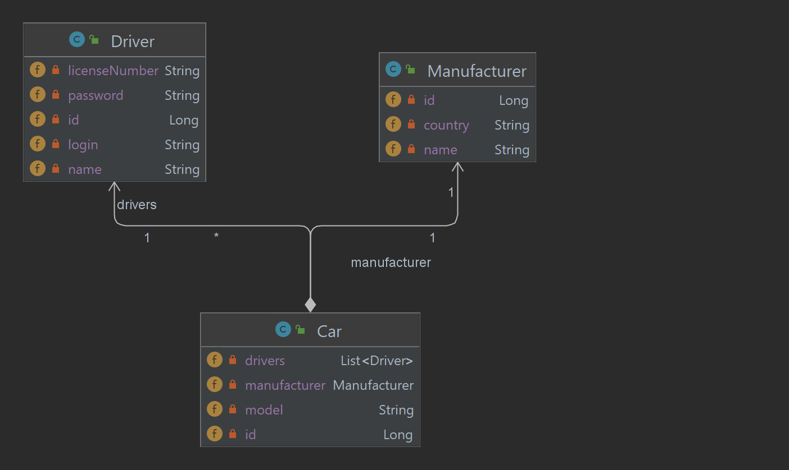
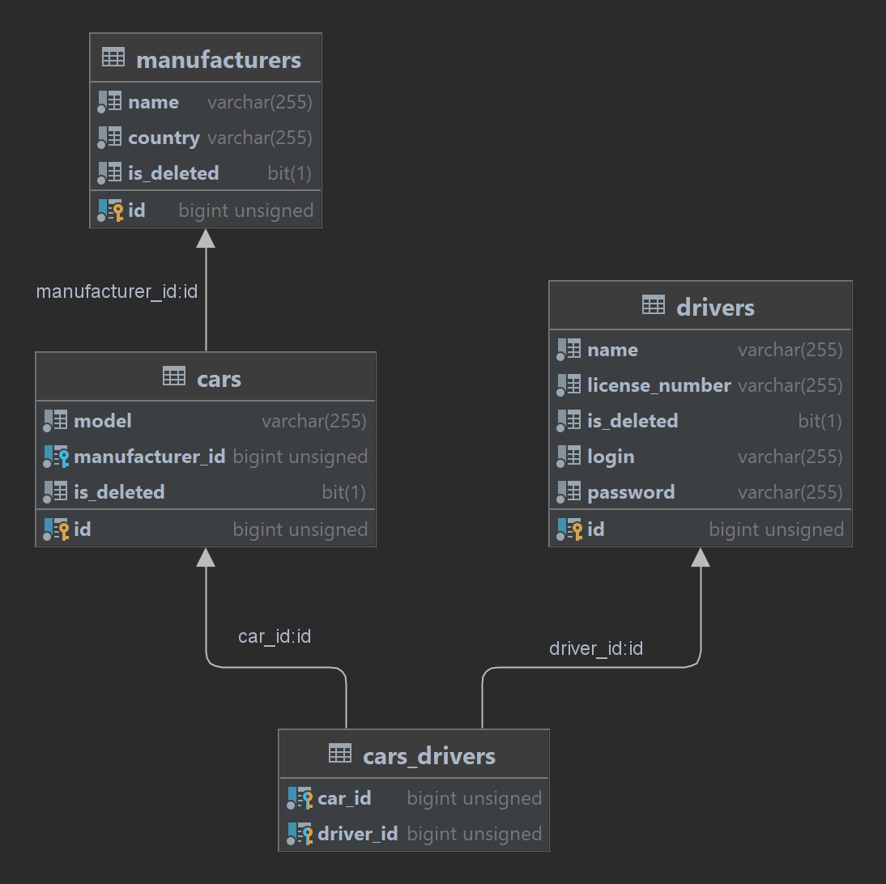

# Taxi Service

---
This is a simple web application to keep records of cars and drivers for companies that provide taxi service.

## Table of content
* [Features](#features)
* [Demo](#demo)
* [Usage](#usage)
* [Technologies](#technologies)
* [Structure](#structure)
* [Installation](#installation)

## <a id="features">Features</a>

---
This application operates with the following entities: 
* drivers
* cars
* car manufacturers

[See structure](#structure)

**Supported features:**

* CRUD operations for drivers, cars and car manufacturers
* Authentication driver like a user
* Display all registered drivers
* Display all registered cars with information about manufacturers and drivers
* Display all cars that are related to currently authenticated driver only
* Add driver to car

## <a id="demo">Demo</a>

---
[Taxi service demo](http://app-env.eba-64csd9dm.eu-north-1.elasticbeanstalk.com/login)

## <a id="usage">Usage</a>

---
Add data in the following order:
1. Register new driver
2. Login to application
3. Add car manufacturer
4. Add car
5. Add driver to car

## <a id="technologies">Technologies</a>

---
This project is created with:
* Java 17
* MySQL 8.0

## <a id="structure">Structure</a>

---

**Entities**



---
**DB model**



## <a id="instalation">Installation</a>

---
1. Create database scheme and tables using scripts from the file: [src/main/resources/init_db.sql](src/main/resources/init_db.sql)
2. Configure fields: URL, USERNAME and PASSWORD in the class [ConnectionUtil](src/main/java/taxi/util/ConnectionUtil.java) with your DB credentials.
   
```java
public class ConnectionUtil {
    private static final String URL = "YOUR DATABASE HOST";
    private static final String USERNAME = "YOUR USERNAME";
    private static final String PASSWORD = "YOUR PASSWORD";
    
    //...
    
}
```
3. Configure environment 
